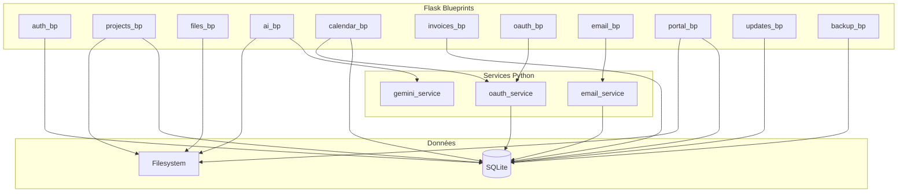

# Composants (Vue Backend)

## Blueprints Flask

## Mapping Blueprint → Préfixe API

| Blueprint | Préfixe | Rôle |
|-----------|---------|------|
| `auth_bp` | `/api/v1/auth/*` | Setup, login, logout, check, reset |
| `projects_bp` | `/api/v1/projects/*` | Scan, save, move, archive, delete |
| `files_bp` | `/api/v1/files/*` | List, open, create, rename, delete, move |
| `ai_bp` | `/api/v1/chat`, `/api/v1/ai/*`, `/api/v1/franck/*`, `/api/v1/media/*` | Franck, briefing, media, dispatch |
| `calendar_bp` | `/api/v1/calendar/*` | Fetch, sync, update, delete (iCal local) |
| `invoices_bp` | `/api/v1/expenses`, `/api/v1/notes`, `/api/v1/time/*` | Dépenses, notes, time tracking |
| `oauth_bp` | `/api/v1/oauth/*`, `/api/v1/drive/*`, `/api/v1/gcal/*` | Google OAuth, Drive, Calendar |
| `email_bp` | `/api/v1/email/*` | IMAP/SMTP (Infomaniak) |
| `portal_bp` | `/api/v1/portal/*` | Portail client (admin + public) |
| `updates_bp` | `/api/v1/version`, `/api/v1/updates/*`, `/api/v1/report-bug` | Version, mises à jour, bugs |
| `backup_bp` | `/api/v1/backup` | Sauvegarde DB |
