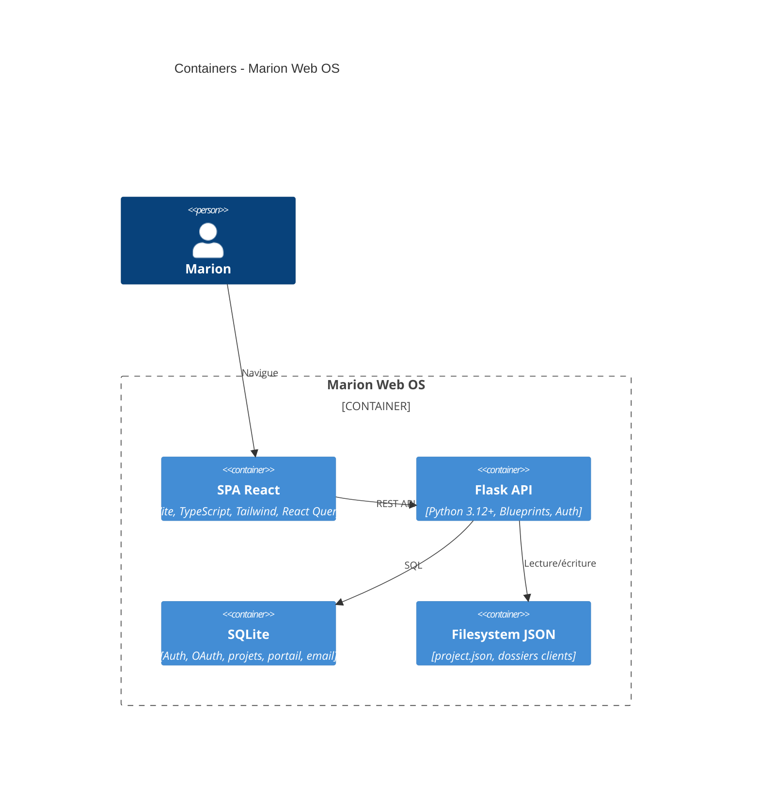
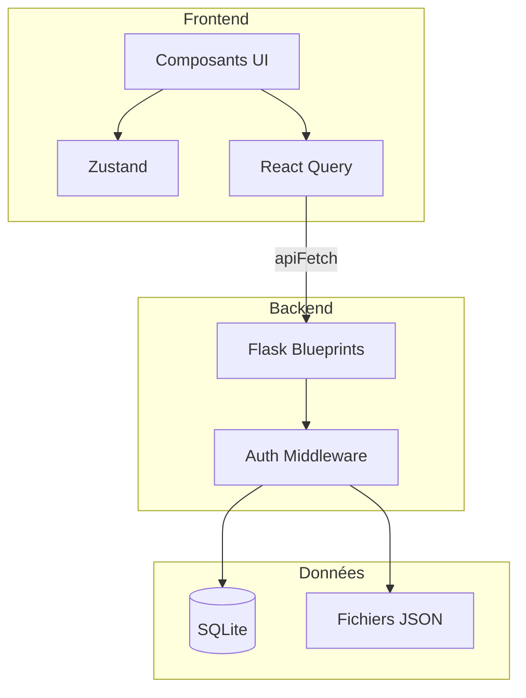

# Containers (C4 — Niveau 2)

## Diagramme

## Détail des containers

| Container | Technologie | Responsabilité |
|-----------|-------------|----------------|
| **SPA React** | React 19, Vite, TypeScript | UI, routing, state (Zustand, React Query), appels API |
| **Flask API** | Flask, Blueprints | REST, auth, orchestration services, CORS |
| **SQLite** | SQLite | Users, sessions, OAuth tokens, projects, tasks, invoices, events, portal |
| **Filesystem JSON** | Fichiers `.json` | `project.json` par client (tâches, profile, brand, moodboard) |

## Alternative : vue simplifiée

