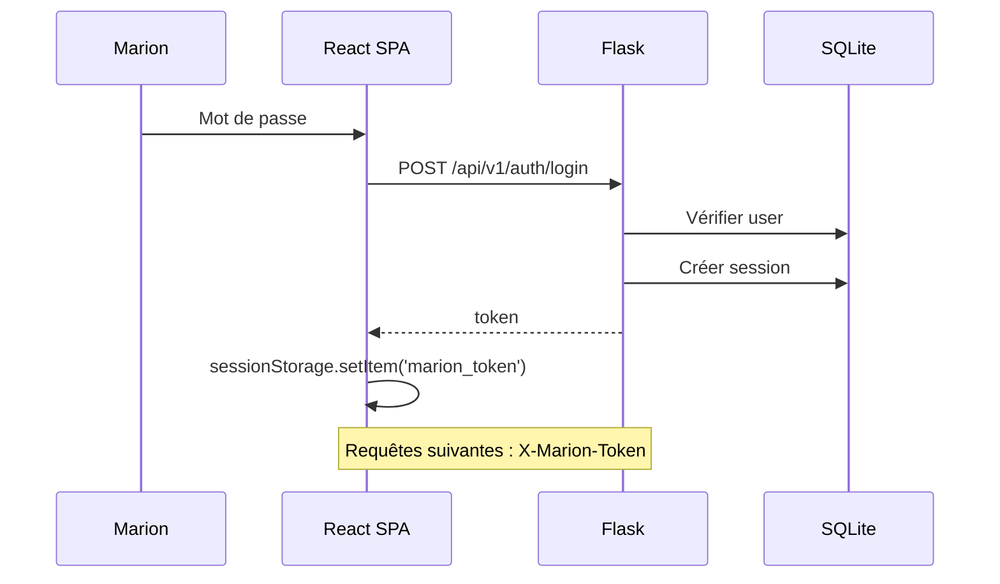
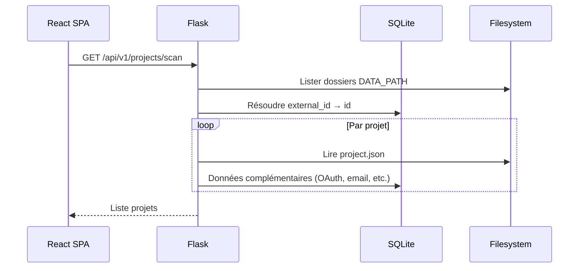
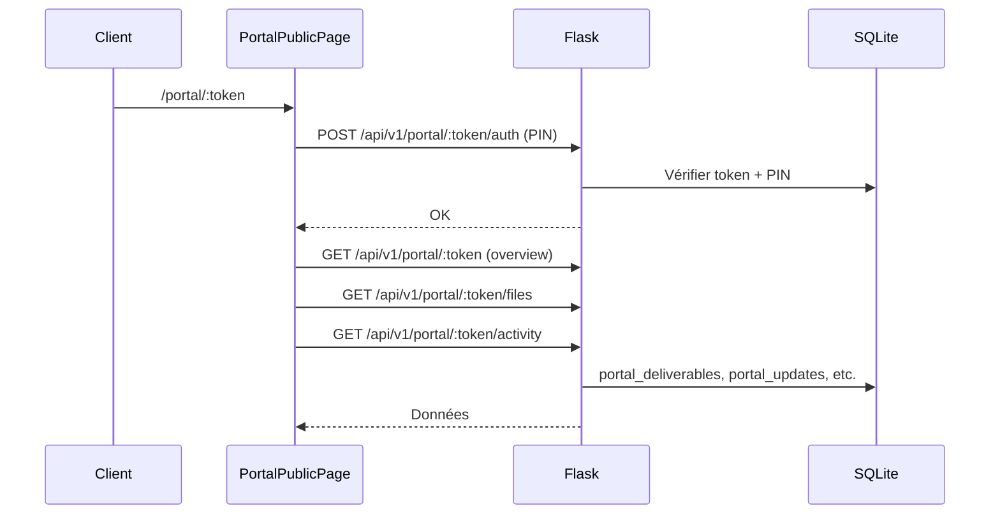
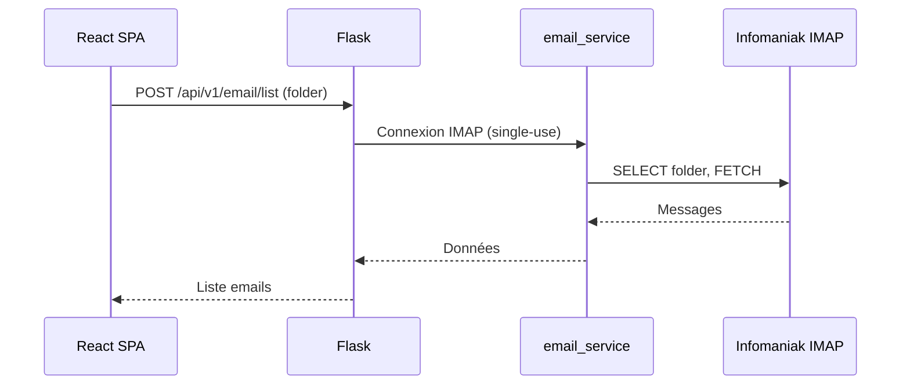
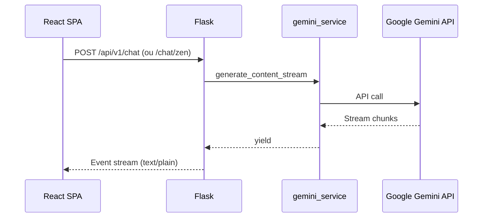

# Flux de données

## 1. Authentification

```mermaid
sequenceDiagram
    participant U as Marion
    participant SPA as React SPA
    participant API as Flask
    participant DB as SQLite

    U->>SPA: Mot de passe
    SPA->>API: POST /api/v1/auth/login
    API->>DB: Vérifier user
    API->>DB: Créer session
    API-->>SPA: token
    SPA->>SPA: sessionStorage.setItem('marion_token')
    Note over SPA,API: Requêtes suivantes : X-Marion-Token
```

## 2. Chargement des projets

```mermaid
sequenceDiagram
    participant SPA as React SPA
    participant API as Flask
    participant DB as SQLite
    participant FS as Filesystem

    SPA->>API: GET /api/v1/projects/scan
    API->>FS: Lister dossiers DATA_PATH
    API->>DB: Résoudre external_id → id
    loop Par projet
        API->>FS: Lire project.json
        API->>DB: Données complémentaires (OAuth, email, etc.)
    end
    API-->>SPA: Liste projets
```

## 3. Portail client (public)

```mermaid
sequenceDiagram
    participant C as Client
    participant SPA as PortalPublicPage
    participant API as Flask
    participant DB as SQLite

    C->>SPA: /portal/:token
    SPA->>API: POST /api/v1/portal/:token/auth (PIN)
    API->>DB: Vérifier token + PIN
    API-->>SPA: OK
    SPA->>API: GET /api/v1/portal/:token (overview)
    SPA->>API: GET /api/v1/portal/:token/files
    SPA->>API: GET /api/v1/portal/:token/activity
    API->>DB: portal_deliverables, portal_updates, etc.
    API-->>SPA: Données
```

## 4. Email (IMAP/SMTP)

```mermaid
sequenceDiagram
    participant SPA as React SPA
    participant API as Flask
    participant Email as email_service
    participant IMAP as Infomaniak IMAP

    SPA->>API: POST /api/v1/email/list (folder)
    API->>Email: Connexion IMAP (single-use)
    Email->>IMAP: SELECT folder, FETCH
    IMAP-->>Email: Messages
    Email-->>API: Données
    API-->>SPA: Liste emails
```

## 5. IA (Franck / Gemini)

```mermaid
sequenceDiagram
    participant SPA as React SPA
    participant API as Flask
    participant Gemini as gemini_service
    participant Google as Google Gemini API

    SPA->>API: POST /api/v1/chat (ou /chat/zen)
    API->>Gemini: generate_content_stream
    Gemini->>Google: API call
    Google-->>Gemini: Stream chunks
    Gemini-->>API: yield
    API-->>SPA: Event stream (text/plain)
```
