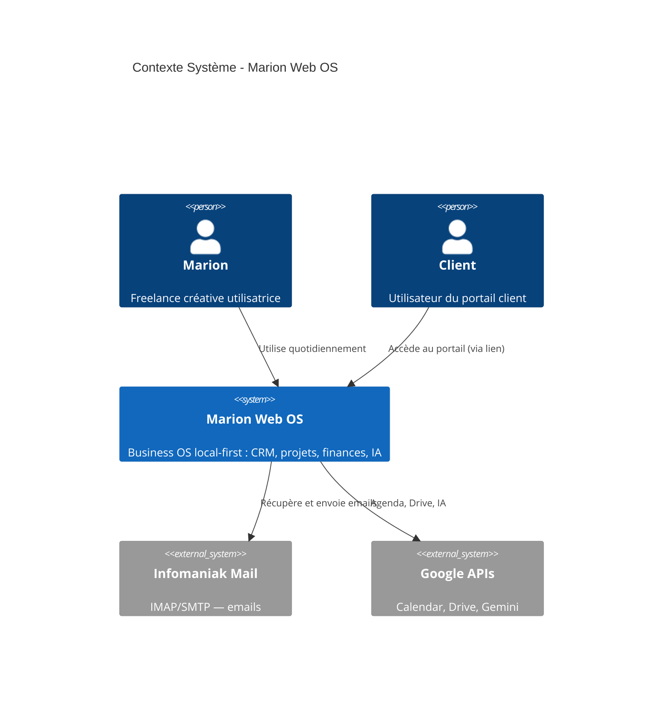

# Contexte Système (C4 — Niveau 1)

## Diagramme

## Acteurs

| Acteur | Description |
|--------|-------------|
| **Marion** | Utilisatrice principale — gère clients, projets, factures, emails, agenda |
| **Client** | Accède au portail public via un lien partagé (token), consulte livrables, commente, téléverse |

## Systèmes externes

| Système | Intégration |
|---------|-------------|
| **Infomaniak Mail** | IMAP (lecture) + SMTP (envoi) — boîte email professionnelle |
| **Google APIs** | OAuth2 — Google Calendar (événements), Drive (sync fichiers), Gemini (IA) |
