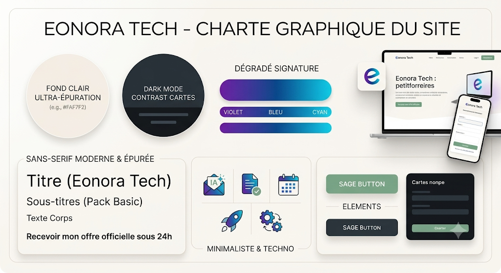

# Charte graphique — Eonora Tech

Charte officielle appliquée à toute l'interface de **Eonora Tech OS** (à partir de la v2.10.0).

## Tokens de marque

| Rôle | Nom | Hex |
|------|-----|-----|
| Fond clair (ultra-épuration) | `--eonora-bg` / `cream` | `#FAF7F2` |
| CTA / boutons primaires (sage) | `--eonora-sage` / `sage` | `#7C9A7E` |
| Sage — survol / pressé | `--eonora-sage-dark` | `#647D66` |
| Sage — secondaire / dégradé doux | `--eonora-sage-light` | `#A7C1A3` |
| Cartes mode sombre | `--eonora-charcoal` / `charcoal` | `#23262B` |
| Fond mode sombre | `--eonora-charcoal-deep` | `#1A1C20` |
| Dégradé — rose/plum (0%) | `--eonora-rose` / `eo-rose` | `#b05070` |
| Dégradé — bleu (55%) | `--eonora-blue` / `eo-blue` | `#4a72c4` |
| Dégradé — teal (100%) | `--eonora-teal` / `eo-teal` | `#2aada0` |

**Dégradé signature :** `linear-gradient(120deg, #b05070 0%, #4a72c4 55%, #2aada0 100%)`
(disponible via la classe utilitaire `bg-eonora-gradient`). Angle **120deg**, stops
rose/plum → bleu → teal — c'est le dégradé du logo « Eonora Tech ».

## Où sont définis les tokens

- **Variables CSS** : `:root` dans `index.css`.
- **Config Tailwind (CDN runtime)** : bloc `tailwind.config` dans `index.html`
  (couleurs `sage`, `charcoal`, `cream`, `eo-*` ; `backgroundImage.eonora-gradient` ;
  remappage de l'échelle `orange` vers des teintes sage).
- **Accent runtime** : `--brand-color` est posé par `App.tsx` d'après la couleur
  d'accentuation choisie dans les Paramètres (sage par défaut).

## Couleurs interdites / à utiliser

**À utiliser (signature de marque uniquement) :**

- Dégradé signature : `bg-eonora-gradient` / `bg-marion-gradient` = `linear-gradient(120deg, #b05070 0%, #4a72c4 55%, #2aada0 100%)`.
- Accents plats : `eo-rose` `#b05070`, `eo-blue` `#4a72c4`, `eo-teal` `#2aada0`.
- CTA / boutons primaires : `sage` `#7C9A7E` (survol `sage-dark` `#647D66`).
- Fonds : crème `#FAF7F2` (clair) / charcoal `#23262B`–`#1A1C20` (sombre).

**Interdites en chrome de marque (héros, en-têtes, CTA, dégradés signature) :**

- Ancien violet/cyan « IA » : `#7C3AED`, `#22D3EE`, dégradés 90° violet→cyan.
- Ancien orange de marque : `#FF7E5F`, `#FEB47B`, `from-orange-*`/`to-amber-*` en accent principal.
- `from-fuchsia-*`, `from-purple-*`, `from-indigo-*`, `from-violet-*` en chrome principal.
- Dégradés arc-en-ciel décoratifs (jaune→bleu→rose→violet…).

> Garde-fou technique : dans la config Tailwind (`index.html`), les échelles
> `orange` → sage, et `indigo` → bleu Eonora, `violet`/`purple`/`fuchsia` → rose Eonora
> sont **remappées**. Les classes héritées restent donc automatiquement dans la palette
> (un dégradé `from-purple-… to-indigo-…` devient rose→bleu = signature Eonora).

**Exceptions tolérées (non concernées par l'interdiction) :**

- Statuts sémantiques : vert (succès), rouge (danger), jaune/ambre (alerte).
- Couleurs tierces de fournisseurs remappées sur la palette (Gemini → bleu, Claude → rose).
- Avatars/catégories à rotation de teintes (variété volontaire par entité).
- `components/InvoiceBuilder.tsx` (non retouché), notes historiques du CHANGELOG, specs Figma.

## Principes

- **Clair d'abord** : monde crème `#FAF7F2`, beaucoup d'espace, cartes douces.
- **Sombre = charcoal** : cartes contrastées + accents sage, sobre et « techno ».
- **Sage pour agir** : les boutons d'action principaux sont sage, texte blanc.
- **Dégradé pour accentuer** : logo, icônes accentuées, surbrillances — pas en aplat de fond.
- **Minimaliste** : typographie sans-serif nette (Montserrat titres / Raleway corps),
  angles légèrement arrondis, ombres discrètes. Éviter la surcharge (glow, pastilles inutiles).

## Exceptions

- `components/InvoiceBuilder.tsx` n'est pas retouché (préférence produit) ; il hérite
  uniquement des tokens globaux.
