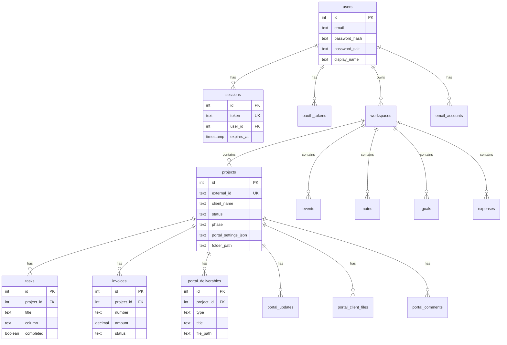

# Base de données — Schéma

## Technologie

**SQLite** — fichier unique (ex. `marion_data.db` ou `Eonora Tech OS Database/marion.db`).

---

## Diagramme ER (simplifié)

---

## Tables principales

| Table | Rôle |
|-------|------|
| `users` | Comptes utilisateurs (email, hash mot de passe) |
| `sessions` | Tokens de session (expiration, encryption key) |
| `workspaces` | Espaces de travail (multi-tenant) |
| `projects` | Projets/clients (sync avec `project.json`) |
| `tasks` | Tâches Kanban (liées aux projets) |
| `invoices` | Factures |
| `expenses` | Dépenses |
| `events` | Événements agenda (local + Google) |
| `notes` | Notes rapides |
| `goals` | Objectifs et KPIs |
| `oauth_tokens` | Tokens Google (Calendar, Drive) |
| `email_accounts` | Comptes email (credentials chiffrés) |
| `portal_deliverables` | Livrables portail client |
| `portal_updates` | Journal d'avancement |
| `portal_client_files` | Fichiers uploadés par le client |
| `portal_comments` | Commentaires |
| `document_templates` | Modèles de documents |
| `invoice_templates` | Modèles de factures |

---

## Colonnes clés — `projects`

| Colonne | Type | Description |
|--------|------|-------------|
| `external_id` | TEXT | Identifiant dossier (ex. `Actif/Johan Vila`) |
| `client_name` | TEXT | Nom du client |
| `status` | TEXT | Prospect, Active, Archived, Pro Bono, Perso |
| `phase` | TEXT | Découverte, Stratégie, Design, etc. |
| `portal_settings_json` | TEXT | Paramètres portail (shareToken, PIN) |
| `folder_path` | TEXT | Chemin dossier projet |
| `profile_json` | TEXT | Profil client, coordonnées |
| `brand_kit_json` | TEXT | Couleurs, polices |
| `maintenance_json` | TEXT | Maintenance, tarifs |

---

## Migrations

Les migrations sont dans `database/migrations/` :

| Fichier | Contenu |
|---------|---------|
| `001_initial.sql` | Tables de base |
| `002_add_email_creds.sql` | Support email |
| `003_add_email_accounts.sql` | Table `email_accounts` |
| `004_portal_tables.sql` | Tables portail client |

---

## Fichiers sources

- `database/schema.sql` — Schéma complet
- `database/db.py` — Accès Python
- `database/migrations/` — Migrations incrémentales
